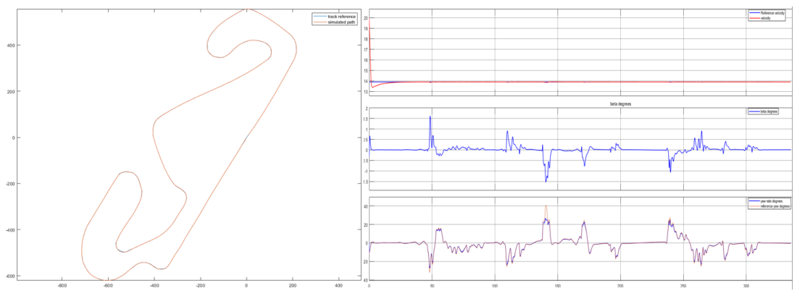
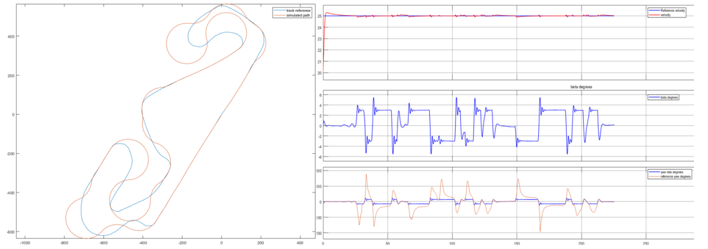

# Longitudinal-and-Lateral-Control-of-a-vehicle

This Project deals with the longitudinal and lateral control of an automotive vehicle within the
framework of fully automated guidance. The automotive vehicle is a complicated system with
nonlinear longitudinal and lateral coupled dynamics. As a result, automated guidance must be
performed in conjunction with longitudinal and lateral control. In this lab, we examine a model
predictive control-based automated steering technique. To deal with the longitudinal speed
tracking problem, a longitudinal control technique is also proposed. Finally, a unified longitudinal
and lateral control strategy helps to improve the combined control performance. 
This whole control strategy is tested through simulations showing the effectiveness of the present approach for a path tracking task using the **Pure Pursuit algorithm**.

# Notice : 
 ###  :red_circle: The Included PDF contains the full details of the dynamic model used, the design of controllers and their assesment and performance analysis for different situations/conditions. 

# This project includes: 
### Longitudinal Control : PI controller 
### Lateral Control: MPC controller 
### Complete non-linear dynamics control : PI + MPC

# Snippets 
- The complete control scheme :

- The performance of the controller evaluated for a path tracking task using the PurevPursuit algorithm for a constant reference velocity of 50km/h ], dry, smooth road: 

- The performance of the controller evaluated for a path tracking task using the PurevPursuit algorithm for a constant reference velocity of 90km/h ], dry, smooth road:

- Solving the problem by using adaptive ( variable/piecewise ) reference velocity:

